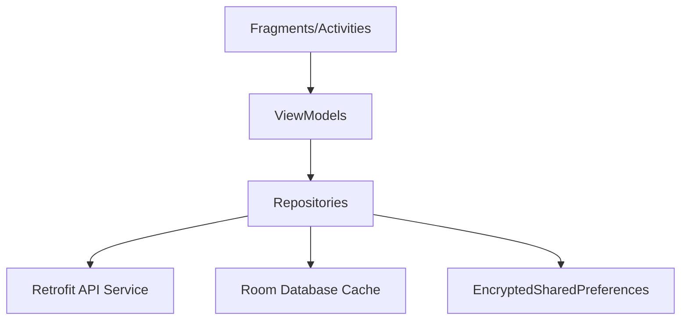

# Aether Studio Showcase — Production Engineering

A high-performance, offline-first Android application built with modern Kotlin standards. This project serves as a technical showcase for **Clean Architecture**, **Reactive Data Streams**, and **Enterprise Security**.

## 🏗 Architecture
The project follows **Clean Architecture** with a strict separation of concerns, implemented via the **MVVM + Repository Pattern**.

### Key Components:
- **Presentation Layer**: ViewBinding, Navigation Component, and Flow-based state management.
- **Domain Layer**: Reactive use cases (Flows) handling both Cache and Network emissions.
- **Data Layer**: Room Persistence for offline-first capability and Retrofit for REST communication.
- **Security Layer**: Aether Integrity Shield (Root/Debugger detection) and AES-256 encryption.

## 🛠 Tech Stack
- **Language**: Kotlin 1.9.x (100%)
- **DI**: Dagger Hilt 2.48
- **Database**: Room 2.6.x (Offline-First)
- **Networking**: Retrofit 2.9 + OkHttp 4.11
- **Visuals**: Facebook Shimmer, Lottie, Material 3
- **Testing**: JUnit 4, MockK, Coroutines Test
- **Build**: Gradle 8.5 / AGP 8.2.2 / Java 21

## 🔒 Security Features
- **Integrity Shield**: Runtime checks for Root, Debuggers, Emulators, and Hooking Frameworks (Frida/Xposed).
- **Crypto**: AES-256-GCM encryption for all session-related data using Jetpack Security.
- **Signature Verification**: Protection against APK tampering and re-signing.

## 🧪 Testing Strategy
- **Unit Tests**: Business logic verification using MockK.
- **Database Tests**: Room DAO verification (In-memory testing).
- **Flow Tests**: Coroutine state emission testing.

## 🚀 Getting Started
1. Clone the repository.
2. Ensure you have **Android Studio Panda (2025.3.4+)** installed.
3. Set your JDK to **Java 17 or 21**.
4. Add your `google-services.json` to the `/app` directory (excluded from VCS for security).
5. Build and Run.

---
*Developed for professional technical evaluation.*